# 데이터 파이프라인 아키텍처 개요

## 🎯 프로젝트 목적
**실시간 CDC 기반 데이터 파이프라인 구축 및 검증**
- MySQL 플랫폼 데이터를 실시간으로 ClickHouse에 동기화
- Flink CDC + Kafka + Flink Sync Connector를 활용한 스트리밍 파이프라인
- Docker Compose 기반 로컬 테스트 환경 구성

## 📊 전체 아키텍처

```mermaid
graph LR
    User[👤 User<br/>HTML Form] --> NestJS[NestJS<br/>Platform Service]
    NestJS --> MySQL[(MySQL<br/>Source DB)]

    MySQL -->|binlog CDC| FlinkCDC[Apache Flink<br/>CDC Job]
    FlinkCDC -->|Change Events| Kafka[Confluent Kafka<br/>KRaft Mode]

    Kafka -->|Stream Data| FlinkSync[Apache Flink<br/>Sync Connector Job]
    FlinkSync --> ClickHouse[(ClickHouse<br/>Analytics DB)]

    ClickHouse --> Dashboard[📊 Real-time<br/>Dashboard]

    style MySQL fill:#4479A1,color:#fff
    style Kafka fill:#231F20,color:#fff
    style ClickHouse fill:#FFCC00,color:#000
    style FlinkCDC fill:#E6526F,color:#fff
    style FlinkSync fill:#E6526F,color:#fff
    style NestJS fill:#E0234E,color:#fff
```



## 🔄 데이터 흐름 상세

### Phase 1: 데이터 생성 (Platform Service)
```
User Input (HTML Form)
    ↓
NestJS REST API (/api/orders)
    ↓
MySQL INSERT/UPDATE/DELETE
    ↓
MySQL Binlog 기록
```

### Phase 2: CDC 캡처 (Flink CDC)
```
MySQL Binlog Monitoring (Flink CDC)
    ↓
Change Event 감지 (INSERT/UPDATE/DELETE)
    ↓
Kafka Topic으로 전송 (orders-cdc-topic)
```

**Change Event 구조 (예시)**:
```json
{
  "before": null,
  "after": {
    "order_id": 1001,
    "user_id": 500,
    "product_name": "Laptop",
    "quantity": 2,
    "total_price": 2000.00,
    "status": "pending",
    "created_at": "2025-01-11T10:30:00Z"
  },
  "op": "c",  // c=create, u=update, d=delete
  "ts_ms": 1736592600000
}
```

### Phase 3: 메시지 큐잉 (Kafka)
```
Kafka Topic: orders-cdc-topic
    ↓
Partitions: 3 (확장성 고려)
    ↓
Retention: 7 days
    ↓
Consumer: Flink Sync Connector
```

### Phase 4: ClickHouse 동기화 (Flink Sync Connector)
```
Kafka Consumer (Flink Job)
    ↓
Data Transformation (필요 시 스키마 변환)
    ↓
ClickHouse Batch Insert (Buffering)
    ↓
Real-time Analytics Table
```

### Phase 5: 실시간 분석
```
ClickHouse Query
    ↓
실시간 대시보드 업데이트
    ↓
비즈니스 인사이트 추출
```

## 🏗️ 컴포넌트 구성

### 1. MySQL (Source Database)
- **역할**: 주문 데이터 저장 및 Binlog 생성
- **버전**: MySQL 8.0+
- **설정**:
  - binlog 활성화 (`binlog_format=ROW`)
  - CDC 전용 사용자 권한 설정
- **테이블**: `users`, `products`, `orders`, `order_items`
- **ERD**:
  ```
  users (1) ──→ orders (N) ←── order_items (N) ←── products (1)
  ```

### 2. Apache Flink CDC Job
- **역할**: MySQL Binlog 실시간 캡처
- **Connector**: flink-connector-mysql-cdc
- **기능**:
  - Full Snapshot + Incremental Sync
  - Schema Evolution 지원
  - Exactly-once 처리 보장

### 3. Confluent Kafka (KRaft Mode)
- **역할**: CDC 이벤트 스트림 버퍼링
- **이미지**: confluentinc/cp-kafka
- **특징**:
  - Zookeeper 불필요 (KRaft 메타데이터 관리)
  - 경량화된 구성
  - 빠른 시작 시간
- **Topic**: `orders-cdc-topic`, `order-items-cdc-topic`

### 4. Apache Flink Sync Connector Job
- **역할**: Kafka → ClickHouse 실시간 동기화
- **Connector**: flink-connector-kafka + flink-connector-clickhouse
- **기능**:
  - Batch Insert 최적화
  - 데이터 변환 (필요 시)
  - 오류 처리 및 재시도

### 5. ClickHouse (Analytics Database)
- **역할**: 실시간 OLAP 분석
- **Engine**: MergeTree Family
- **기능**:
  - 컬럼 기반 스토리지
  - 실시간 집계 쿼리
  - Materialized View 지원

### 6. NestJS Platform Service
- **역할**: 플랫폼 데이터 생성 API
- **엔드포인트**:
  - `POST /api/orders` - 주문 생성
  - `GET /api/orders` - 주문 조회
  - `GET /api/orders/:id` - 주문 상세
- **DB**: TypeORM + MySQL

### 7. HTML Frontend
- **역할**: 간단한 주문 생성 폼
- **기능**:
  - 주문 입력 및 제출
  - 주문 목록 조회
  - 실시간 통계 조회 (ClickHouse)

## 🐳 Docker Compose 구성

```yaml
services:
  - mysql (Source DB)
  - kafka (Confluent Kafka KRaft)
  - flink-jobmanager (Flink Master)
  - flink-taskmanager (Flink Worker)
  - clickhouse (Analytics DB)
  - platform-api (Platform Service)
  - nginx (Frontend Static)
```

## 📈 확장성 고려사항

### 트래픽 증가 시
- **Kafka Partitions**: 3 → 6+ (병렬 처리)
- **Flink TaskManager**: 1 → N (수평 확장)
- **ClickHouse Sharding**: 단일 노드 → 분산 클러스터

### 데이터 볼륨 증가 시
- **Kafka Retention**: 7일 → 30일 (디스크 증설)
- **ClickHouse Partitioning**: 월별 파티션
- **MySQL Read Replica**: CDC 전용 Replica 분리

## 🔒 데이터 일관성 보장

### Exactly-Once Semantics
```
MySQL Transaction
    ↓
Flink CDC Checkpoint (State Backend)
    ↓
Kafka Transactional Producer
    ↓
Flink Sync Checkpoint
    ↓
ClickHouse Idempotent Insert
```

### 장애 복구
- **Flink Checkpoint**: 1분마다 상태 저장
- **Kafka Offset Commit**: Consumer Group 기반 관리
- **ClickHouse Deduplication**: ReplacingMergeTree 엔진

## 📊 모니터링 포인트

### CDC 지연 시간
```sql
-- Flink CDC 메트릭
SELECT
    current_timestamp - MAX(event_time) AS cdc_lag
FROM kafka_topic_metadata;
```

### 데이터 정합성 체크
```sql
-- MySQL vs ClickHouse 카운트 비교
-- MySQL
SELECT COUNT(*) FROM orders;

-- ClickHouse
SELECT COUNT(*) FROM orders_realtime;
```

### Kafka Consumer Lag
```bash
# Kafka Consumer Group 지연 확인
kafka-consumer-groups --bootstrap-server kafka:9092 \
  --group flink-sync-connector \
  --describe
```

## 🧪 테스트 시나리오

### 1. 기본 데이터 흐름 테스트
```bash
# 1. 주문 생성
curl -X POST http://localhost:3000/api/orders \
  -H "Content-Type: application/json" \
  -d '{"user_id": 1, "product_name": "Test Product", "quantity": 1, "total_price": 100}'

# 2. ClickHouse 확인 (약 1-2초 후)
docker exec clickhouse-server clickhouse-client \
  --query "SELECT * FROM orders_realtime ORDER BY created_at DESC LIMIT 10"
```

### 2. 대량 데이터 테스트
```bash
# 100건의 주문 생성
for i in {1..100}; do
  curl -X POST http://localhost:3000/api/orders \
    -H "Content-Type: application/json" \
    -d "{\"user_id\": $i, \"product_name\": \"Product $i\", \"quantity\": 1, \"total_price\": 100}"
done
```

### 3. 장애 복구 테스트
```bash
# Flink 재시작
docker restart flink-jobmanager

# 데이터 일관성 확인
# MySQL과 ClickHouse 카운트가 일치해야 함
```

## 📝 성능 목표 (MVP)

| 메트릭 | 목표 | 측정 방법 |
|--------|------|-----------|
| CDC 지연 시간 | < 2초 | Event Time - Processing Time |
| End-to-End 지연 | < 5초 | MySQL INSERT → ClickHouse SELECT |
| 처리량 | 100-1,000 TPS | Kafka Throughput 메트릭 |
| 데이터 정합성 | 100% | MySQL vs ClickHouse Count |

## 🚀 배포 순서

1. **인프라 시작**
```bash
docker-compose up -d mysql kafka clickhouse
```

2. **Flink Job 배포**
```bash
# CDC Job 제출
docker exec flink-jobmanager flink run \
  /opt/flink/jobs/mysql-cdc-job.jar

# Sync Connector Job 제출
docker exec flink-jobmanager flink run \
  /opt/flink/jobs/kafka-clickhouse-sync-job.jar
```

3. **애플리케이션 시작**
```bash
docker-compose up -d platform-api nginx
```

4. **검증**
```bash
# 헬스체크
curl http://localhost:3000/health
curl http://localhost:8123/ping
```

## 🔍 다음 단계
- [Flink CDC MySQL 설정](./02-flink-cdc-mysql.md)
- [Confluent Kafka 구성](./03-confluent-kafka.md)
- [Flink Sync Connector 설정](./04-flink-sync-connector.md)
- [ClickHouse 스키마 설계](./05-clickhouse-schema.md)
