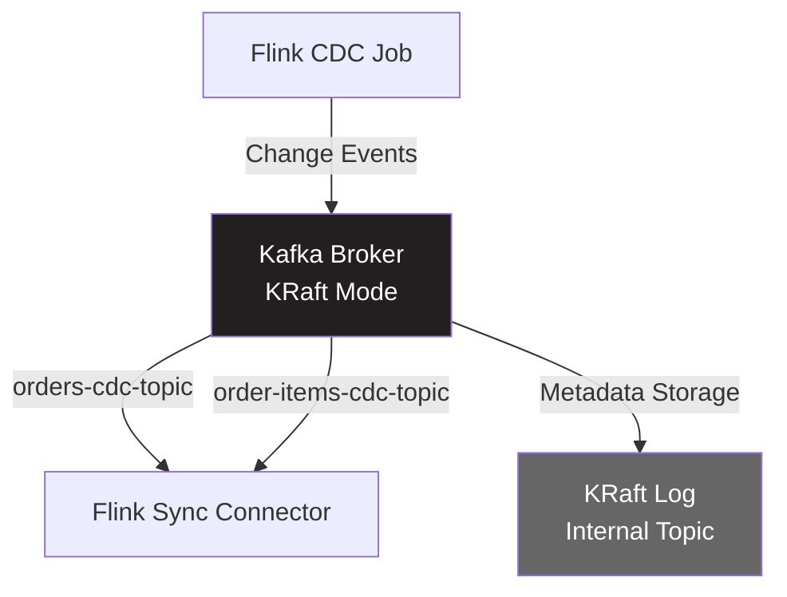

# Confluent Kafka 구성 (KRaft 모드)

## 📋 개요
Zookeeper 없이 KRaft 모드로 Confluent Kafka를 구성하여 CDC 이벤트 스트림 처리

## 🎯 KRaft 모드란?
- **KRaft (Kafka Raft)**: Kafka 자체적으로 메타데이터를 관리하는 새로운 아키텍처
- **Zookeeper 불필요**: 경량화 및 관리 복잡도 감소
- **Kafka 2.8+ 지원**, **Kafka 3.3+ 프로덕션 사용 권장**
- **Confluent 7.0+**: KRaft 안정화 버전

## 🏗️ 아키텍처



## 🐳 Docker Compose 설정

### 기본 구성 (confluentinc/cp-kafka)
```yaml
services:
  kafka:
    image: confluentinc/cp-kafka:7.6.0
    container_name: kafka
    hostname: kafka
    ports:
      - "9092:9092"    # 외부 접속용
      - "9093:9093"    # 컨트롤러 통신용
    environment:
      # KRaft 모드 설정
      KAFKA_NODE_ID: 1
      KAFKA_PROCESS_ROLES: broker,controller
      KAFKA_CONTROLLER_QUORUM_VOTERS: 1@kafka:9093
      KAFKA_CONTROLLER_LISTENER_NAMES: CONTROLLER

      # 리스너 설정
      KAFKA_LISTENERS: PLAINTEXT://0.0.0.0:9092,CONTROLLER://0.0.0.0:9093
      KAFKA_ADVERTISED_LISTENERS: PLAINTEXT://kafka:9092
      KAFKA_LISTENER_SECURITY_PROTOCOL_MAP: PLAINTEXT:PLAINTEXT,CONTROLLER:PLAINTEXT
      KAFKA_INTER_BROKER_LISTENER_NAME: PLAINTEXT

      # 클러스터 ID (UUID 형식)
      CLUSTER_ID: MkU3OEVBNTcwNTJENDM2Qk

      # 로그 디렉토리
      KAFKA_LOG_DIRS: /var/lib/kafka/data

      # 성능 튜닝
      KAFKA_OFFSETS_TOPIC_REPLICATION_FACTOR: 1
      KAFKA_TRANSACTION_STATE_LOG_REPLICATION_FACTOR: 1
      KAFKA_TRANSACTION_STATE_LOG_MIN_ISR: 1

      # 로그 보관 정책
      KAFKA_LOG_RETENTION_HOURS: 168  # 7일
      KAFKA_LOG_SEGMENT_BYTES: 1073741824  # 1GB

      # JVM 힙 메모리
      KAFKA_HEAP_OPTS: "-Xmx512M -Xms512M"

    volumes:
      - kafka-data:/var/lib/kafka/data
    networks:
      - cdc-network
    healthcheck:
      test: ["CMD", "kafka-broker-api-versions", "--bootstrap-server", "localhost:9092"]
      interval: 10s
      timeout: 5s
      retries: 5

volumes:
  kafka-data:
    driver: local

networks:
  cdc-network:
    driver: bridge
```

### 클러스터 ID 생성 방법
```bash
# 클러스터 ID 생성 (UUID)
docker run --rm confluentinc/cp-kafka:7.6.0 kafka-storage random-uuid

# 출력 예시:
# MkU3OEVBNTcwNTJENDM2Qk
```

## 📌 Topic 설계

### 1. orders-cdc-topic
```yaml
Topic Name: orders-cdc-topic
Purpose: orders 테이블 CDC 이벤트 스트림
Partitions: 1  # CDC 순서 보장을 위해 1개로 설정
Replication Factor: 1 (단일 브로커)
Retention: 7 days
Cleanup Policy: delete
```

### 2. order-items-cdc-topic
```yaml
Topic Name: order-items-cdc-topic
Purpose: order_items 테이블 CDC 이벤트 스트림
Partitions: 1  # CDC 순서 보장을 위해 1개로 설정
Replication Factor: 1
Retention: 7 days
Cleanup Policy: delete
```

### Topic 생성 스크립트
```bash
#!/bin/bash

# Topic 생성 함수
create_topic() {
  local topic_name=$1
  local partitions=$2
  local retention_ms=$3

  docker exec -it kafka kafka-topics --create \
    --bootstrap-server localhost:9092 \
    --topic ${topic_name} \
    --partitions ${partitions} \
    --replication-factor 1 \
    --config retention.ms=${retention_ms} \
    --config cleanup.policy=delete

  echo "✅ Topic '${topic_name}' created with ${partitions} partitions"
}

# CDC Topics 생성 (CDC 순서 보장을 위해 파티션 1개)
create_topic "orders-cdc-topic" 1 604800000       # 7일 (7 * 24 * 60 * 60 * 1000)
create_topic "order-items-cdc-topic" 1 604800000  # 7일

# Topic 목록 확인
docker exec -it kafka kafka-topics --list --bootstrap-server localhost:9092
```

## 🔧 Kafka 관리 명령어

### Topic 관리
```bash
# 1. Topic 목록 확인
docker exec -it kafka kafka-topics --list --bootstrap-server localhost:9092

# 2. Topic 상세 정보
docker exec -it kafka kafka-topics --describe \
  --bootstrap-server localhost:9092 \
  --topic orders-cdc-topic

# 3. Topic 삭제
docker exec -it kafka kafka-topics --delete \
  --bootstrap-server localhost:9092 \
  --topic orders-cdc-topic

# 4. Topic 설정 변경 (retention 기간)
docker exec -it kafka kafka-configs --alter \
  --bootstrap-server localhost:9092 \
  --entity-type topics \
  --entity-name orders-cdc-topic \
  --add-config retention.ms=1209600000  # 14일
```

### Producer 테스트
```bash
# 콘솔 프로듀서로 테스트 메시지 전송
docker exec -it kafka kafka-console-producer \
  --bootstrap-server localhost:9092 \
  --topic orders-cdc-topic

# 입력 (Ctrl+D로 종료):
# {"order_id": 1, "user_id": 100, "product_name": "Test", "quantity": 1}
```

### Consumer 테스트
```bash
# 1. 처음부터 모든 메시지 읽기
docker exec -it kafka kafka-console-consumer \
  --bootstrap-server localhost:9092 \
  --topic orders-cdc-topic \
  --from-beginning

# 2. 최신 메시지만 읽기
docker exec -it kafka kafka-console-consumer \
  --bootstrap-server localhost:9092 \
  --topic orders-cdc-topic

# 3. Consumer Group으로 읽기
docker exec -it kafka kafka-console-consumer \
  --bootstrap-server localhost:9092 \
  --topic orders-cdc-topic \
  --group flink-sync-consumer \
  --from-beginning

# 4. 특정 개수만 읽기
docker exec -it kafka kafka-console-consumer \
  --bootstrap-server localhost:9092 \
  --topic orders-cdc-topic \
  --from-beginning \
  --max-messages 10
```

### Consumer Group 관리
```bash
# 1. Consumer Group 목록
docker exec -it kafka kafka-consumer-groups --list \
  --bootstrap-server localhost:9092

# 2. Consumer Group 상세 정보 (Lag 확인)
docker exec -it kafka kafka-consumer-groups --describe \
  --bootstrap-server localhost:9092 \
  --group flink-sync-consumer

# 3. Consumer Group Offset 리셋
docker exec -it kafka kafka-consumer-groups --reset-offsets \
  --bootstrap-server localhost:9092 \
  --group flink-sync-consumer \
  --topic orders-cdc-topic \
  --to-earliest \
  --execute
```

## 📊 메시지 형식 예시

### CDC Insert Event
```json
{
  "before": null,
  "after": {
    "order_id": 1001,
    "user_id": 500,
    "product_name": "Laptop",
    "quantity": 2,
    "total_price": 2000.00,
    "status": "pending",
    "created_at": "2025-01-11T10:30:00Z",
    "updated_at": "2025-01-11T10:30:00Z"
  },
  "source": {
    "version": "3.0.1",
    "connector": "mysql",
    "name": "mysql-server",
    "ts_ms": 1736592600000,
    "db": "order_db",
    "table": "orders",
    "server_id": 1,
    "file": "mysql-bin.000003",
    "pos": 1234
  },
  "op": "c",
  "ts_ms": 1736592600123
}
```

### CDC Update Event
```json
{
  "before": {
    "order_id": 1001,
    "user_id": 500,
    "product_name": "Laptop",
    "quantity": 2,
    "total_price": 2000.00,
    "status": "pending",
    "created_at": "2025-01-11T10:30:00Z",
    "updated_at": "2025-01-11T10:30:00Z"
  },
  "after": {
    "order_id": 1001,
    "user_id": 500,
    "product_name": "Laptop",
    "quantity": 2,
    "total_price": 2000.00,
    "status": "completed",
    "created_at": "2025-01-11T10:30:00Z",
    "updated_at": "2025-01-11T11:45:00Z"
  },
  "source": {
    "version": "3.0.1",
    "connector": "mysql",
    "name": "mysql-server",
    "ts_ms": 1736596500000,
    "db": "order_db",
    "table": "orders",
    "server_id": 1,
    "file": "mysql-bin.000003",
    "pos": 5678
  },
  "op": "u",
  "ts_ms": 1736596500456
}
```

### CDC Delete Event
```json
{
  "before": {
    "order_id": 1001,
    "user_id": 500,
    "product_name": "Laptop",
    "quantity": 2,
    "total_price": 2000.00,
    "status": "completed",
    "created_at": "2025-01-11T10:30:00Z",
    "updated_at": "2025-01-11T11:45:00Z"
  },
  "after": null,
  "source": {
    "version": "3.0.1",
    "connector": "mysql",
    "name": "mysql-server",
    "ts_ms": 1736600100000,
    "db": "order_db",
    "table": "orders",
    "server_id": 1,
    "file": "mysql-bin.000003",
    "pos": 9012
  },
  "op": "d",
  "ts_ms": 1736600100789
}
```

## 🔍 모니터링

### Kafka 메트릭 확인
```bash
# JMX 메트릭 조회
docker exec -it kafka kafka-run-class kafka.tools.JmxTool \
  --object-name kafka.server:type=BrokerTopicMetrics,name=MessagesInPerSec

# Broker 메타데이터
docker exec -it kafka kafka-metadata-shell \
  --snapshot /var/lib/kafka/data/__cluster_metadata-0/00000000000000000000.log \
  --print-controllers
```

### Kafka UI 도구 추가 (선택적)
```yaml
services:
  kafka-ui:
    image: provectuslabs/kafka-ui:latest
    container_name: kafka-ui
    ports:
      - "8080:8080"
    environment:
      KAFKA_CLUSTERS_0_NAME: local
      KAFKA_CLUSTERS_0_BOOTSTRAPSERVERS: kafka:9092
    depends_on:
      - kafka
    networks:
      - cdc-network
```

**접속**: http://localhost:8080

## ⚙️ 성능 튜닝

### MVP 환경 (소규모 트래픽)
```yaml
environment:
  # CDC Topic Partition (순서 보장을 위해 1로 설정)
  KAFKA_NUM_PARTITIONS: 1

  # Replication Factor
  KAFKA_OFFSETS_TOPIC_REPLICATION_FACTOR: 1
  KAFKA_TRANSACTION_STATE_LOG_REPLICATION_FACTOR: 1

  # 메모리 최적화
  KAFKA_HEAP_OPTS: "-Xmx512M -Xms512M"

  # 로그 세그먼트 크기
  KAFKA_LOG_SEGMENT_BYTES: 536870912  # 512MB

  # Flush 정책 (비동기)
  KAFKA_LOG_FLUSH_INTERVAL_MESSAGES: 10000
  KAFKA_LOG_FLUSH_INTERVAL_MS: 1000
```

### 프로덕션 환경 (대규모 트래픽)
```yaml
environment:
  # CDC Topic Partition (Key 기반 파티셔닝 필수!)
  # 주의: Flink CDC에서 order_id를 Kafka Key로 설정해야 순서 보장
  KAFKA_NUM_PARTITIONS: 6

  # Replication Factor
  KAFKA_OFFSETS_TOPIC_REPLICATION_FACTOR: 3
  KAFKA_TRANSACTION_STATE_LOG_REPLICATION_FACTOR: 3

  # 메모리 확대
  KAFKA_HEAP_OPTS: "-Xmx4G -Xms4G"

  # 압축 활성화
  KAFKA_COMPRESSION_TYPE: snappy

  # Retention 연장
  KAFKA_LOG_RETENTION_HOURS: 720  # 30일
```

## 🧪 테스트 시나리오

### 1. Kafka 정상 동작 확인
```bash
# 1. Kafka 컨테이너 상태
docker ps | grep kafka

# 2. Kafka 로그 확인
docker logs kafka -f

# 3. Broker 상태 확인
docker exec -it kafka kafka-broker-api-versions --bootstrap-server localhost:9092
```

### 2. Topic 생성 및 메시지 전송
```bash
# Topic 생성
docker exec -it kafka kafka-topics --create \
  --bootstrap-server localhost:9092 \
  --topic test-topic \
  --partitions 1 \
  --replication-factor 1

# Producer 실행
docker exec -it kafka kafka-console-producer \
  --bootstrap-server localhost:9092 \
  --topic test-topic

# 메시지 입력:
# Hello Kafka
# Test Message

# Consumer 실행 (다른 터미널)
docker exec -it kafka kafka-console-consumer \
  --bootstrap-server localhost:9092 \
  --topic test-topic \
  --from-beginning
```

### 3. CDC 파이프라인 통합 테스트
```bash
# 1. MySQL에 데이터 삽입
docker exec -it mysql mysql -u root -p
USE order_db;
INSERT INTO orders (user_id, product_name, quantity, total_price)
VALUES (100, 'Test Product', 1, 50.00);

# 2. Kafka Topic에서 CDC 이벤트 확인
docker exec -it kafka kafka-console-consumer \
  --bootstrap-server localhost:9092 \
  --topic orders-cdc-topic \
  --from-beginning

# 3. Consumer Lag 확인
docker exec -it kafka kafka-consumer-groups --describe \
  --bootstrap-server localhost:9092 \
  --group flink-sync-consumer
```

## 🚨 트러블슈팅

### 문제 1: Kafka 시작 실패
```bash
# 로그 확인
docker logs kafka

# 일반적인 원인:
# - CLUSTER_ID 미설정
# - 포트 충돌 (9092, 9093)
# - 볼륨 권한 문제

# 해결: 볼륨 초기화
docker-compose down -v
docker-compose up -d kafka
```

### 문제 2: Topic 생성 실패
```bash
# Broker 연결 확인
docker exec -it kafka kafka-broker-api-versions --bootstrap-server localhost:9092

# 네트워크 확인
docker network inspect cdc-network
```

### 문제 3: Consumer Lag 증가
```bash
# Lag 확인
docker exec -it kafka kafka-consumer-groups --describe \
  --bootstrap-server localhost:9092 \
  --group flink-sync-consumer

# 원인:
# - Consumer 처리 속도 < Producer 처리 속도
# - Flink Sync Connector Job 중단

# 해결:
# - Partition 수 증가
# - Consumer 병렬도 증가 (Flink TaskManager)
```

### 문제 4: 메시지 손실
```bash
# Producer ACK 설정 확인
KAFKA_ACKS: all  # 모든 Replica 확인

# Replication Factor 확인
docker exec -it kafka kafka-topics --describe \
  --bootstrap-server localhost:9092 \
  --topic orders-cdc-topic

# min.insync.replicas 설정 (프로덕션)
KAFKA_MIN_INSYNC_REPLICAS: 2
```

## 🔒 보안 설정 (선택적)

### SASL/SCRAM 인증
```yaml
environment:
  # SASL 활성화
  KAFKA_SASL_ENABLED_MECHANISMS: SCRAM-SHA-256
  KAFKA_SASL_MECHANISM_INTER_BROKER_PROTOCOL: SCRAM-SHA-256

  # Listener 수정
  KAFKA_LISTENERS: SASL_PLAINTEXT://0.0.0.0:9092,CONTROLLER://0.0.0.0:9093
  KAFKA_ADVERTISED_LISTENERS: SASL_PLAINTEXT://kafka:9092
  KAFKA_LISTENER_SECURITY_PROTOCOL_MAP: SASL_PLAINTEXT:SASL_PLAINTEXT,CONTROLLER:PLAINTEXT
```

### SSL 암호화
```yaml
environment:
  KAFKA_LISTENERS: SSL://0.0.0.0:9092,CONTROLLER://0.0.0.0:9093
  KAFKA_ADVERTISED_LISTENERS: SSL://kafka:9092
  KAFKA_SSL_KEYSTORE_LOCATION: /etc/kafka/secrets/kafka.keystore.jks
  KAFKA_SSL_KEYSTORE_PASSWORD: changeit
  KAFKA_SSL_KEY_PASSWORD: changeit
  KAFKA_SSL_TRUSTSTORE_LOCATION: /etc/kafka/secrets/kafka.truststore.jks
  KAFKA_SSL_TRUSTSTORE_PASSWORD: changeit
```

## 🎯 CDC Partition 전략

### MVP 권장: 파티션 1개 (순서 보장 우선)

**이유**:
1. **순서 보장**: CDC 이벤트는 순서가 중요 (INSERT → UPDATE → DELETE)
2. **데이터 정합성**: 순서가 뒤바뀌면 데이터 손실/오류 발생 가능
3. **충분한 성능**: MVP 목표 100-1,000 TPS는 파티션 1개로도 처리 가능
4. **단순성**: Key 설정 불필요, Flink CDC 코드 수정 최소화

**순서 보장 예시**:
```
✅ 올바른 순서 (파티션 1개):
1. INSERT order_id=100, status='PENDING'
2. UPDATE order_id=100, status='CONFIRMED'
3. DELETE order_id=100

❌ 잘못된 순서 (파티션 3개, Key 없음):
1. DELETE order_id=100  ← 먼저 삭제
2. INSERT order_id=100  ← 나중에 삽입 (순서 역전!)
3. UPDATE order_id=100  ← 존재하지 않는 데이터 업데이트
```

### 프로덕션 고려사항: 파티션 증가 (Key 기반 파티셔닝)

**조건**:
- 처리량 > 10,000 TPS
- Flink CDC에서 **order_id를 Kafka Message Key로 설정**
- 같은 order_id는 같은 파티션으로 전송 보장

**Flink CDC 코드 수정 예시** (프로덕션 시):
```java
// order_id를 Key로 추출하는 Serializer 구현 필요
KafkaSink<String> ordersSink = KafkaSink.<String>builder()
    .setBootstrapServers(CDCConfig.KAFKA_BOOTSTRAP_SERVERS)
    .setRecordSerializer(
        KafkaRecordSerializationSchema.builder()
            .setTopic(CDCConfig.KAFKA_TOPIC_ORDERS)
            .setKeySerializationSchema(new OrderIdKeySerializer())  // ← Key 추출
            .setValueSerializationSchema(new SimpleStringSchema())
            .build()
    )
    .build();
```

**장점**:
- ✅ 높은 처리량 (병렬 처리)
- ✅ 확장성 (Consumer 추가 가능)
- ✅ 같은 order_id는 순서 보장

**단점**:
- ❌ 구현 복잡도 증가 (Key Serializer 구현)
- ❌ 파티션 간 순서 보장 안됨 (다른 order_id)

## 📚 참고 자료
- [Confluent Kafka Docker 가이드](https://docs.confluent.io/platform/current/installation/docker/config-reference.html)
- [KRaft 모드 공식 문서](https://kafka.apache.org/documentation/#kraft)
- [Kafka Topic 설정 Best Practices](https://kafka.apache.org/documentation/#topicconfigs)

## 🔍 다음 단계
- [Flink Sync Connector 설정](./04-flink-sync-connector.md) - Kafka → ClickHouse 동기화
- [ClickHouse 스키마 설계](./05-clickhouse-schema.md) - 실시간 분석 테이블
